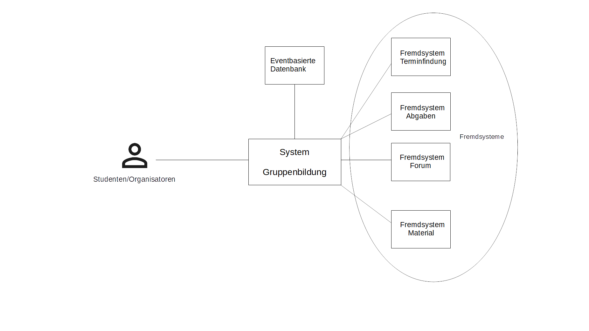
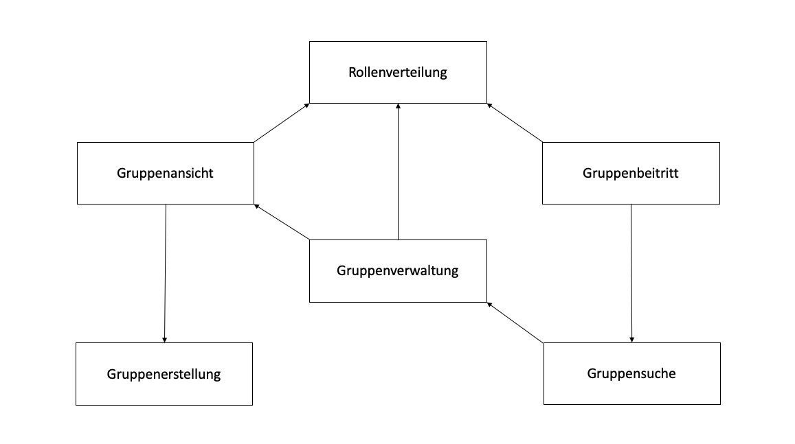

== Dokumentation der Software-Architektur des Gruppenbildungsprojekts

Dieses Dokument dient sowohl der Dokumentation, als auch der Kommunikation der
Software-Archtitektur des Gruppenbildung-Projekts. +
Die vorliegende Dokumentation orientiert sich dabei am https://www.arc42.de[arc42-Template] für Software-Architektur-Dokumentationen.

== Einführung und Ziele

Dieser Abschnitt führt in die Aufgabenstellung des
Gruppenbildungsprojekts ein und soll die Ziele, sowohl
die geschäftlichen als auch Qualitätsziele, darlegen.

=== Aufgabenstellung

Das primäre Ziel des Projektes ist, ein Self-Contained-System bereitzustellen, welches die
Funktion der

* Gruppenbildung
** Gruppensuche nach bestehenden Gruppen

bereitstellt. Dies soll das Organisieren von eigenen Lerngruppen/Abgabengruppen und das gemeinsame Arbeiten an
Vorlesungsinhalten und/oder Übungsblättern erleichtern.

Ein weiteres Ziel ist, dass dieses System Schnittstellen zu weiteren Systemen
bieten soll, in denen gruppenspezifische Dienste sinnvoll sind. Diese Systeme sind:

* Materialsammlung
* Terminfindung
* Foren
* Abgabesystem

=== Qualitätsziele

Die folgende Tabelle beschreibt die Qualitätsziele des
Gruppenbildungssystems. +
Dabei spielt die Reihenfolge *keine Rolle* bezüglich der
Wichtigkeit der Ziele.

|===
|*Qualitätsziel*|*Motivation & Erläuterung*
|Leicht zugänglich & übersichtlich| User des Gruppenbildungssystems sollen
sich schnell zurecht finden. Dabei soll die UI nur notwendigste
Elemente besitzen.
|Autarkes SCS, Modularität|Die verwendete Onion-Architektur sorgt dafür,
dass externe Komponenten wie Datenbanken leicht ausgetauscht werden können,
da Abhängigkeiten zu externen Services vermieden werden.
|Gute Performance|Durch eine eventbasierte Datenbank und schnelle
In-Memory-Datenstrukturen wird eine gute Performance des Systems gewährleistet.
|===

=== Stakeholder

Die folgende Tabelle beschreibt Personengruppen, die einen Bezug und ein Interesse am Projekt aufweisen.

|===
|*Wer?*|*Interesse, Bezug*
|Studenten|- Wollen schnell und unkompliziert Gruppen bilden und suchen +
- Erhoffen sich Zeitersparnis bei der Suche nach Kommilitonen für das gemeinsame Lernen
und für Gruppenabgaben +
- Wollen ein performantes System nutzen
|Entwickler|- Wollen System mit vertretbarem Aufwand erweitern +
- Wollen neue Systeme mit vertretbarem Aufwand an das Gruppenbildungssystem anbinden +
|Organisatoren|- Wollen selbstständig Gruppen für Ihre Veranstaltungen anlegen +
- Wollen ein performantes System nutzen
|===

== Kontextabgrenzung

Der folgende Abschnitt beschreibt die Umgebung in der sich das Gruppenbildungsprojekt befindet. +
Dabei wird darauf eingegangen, welche Nutzer das System verwenden werden und mit welchen externen
Systemen das Gruppenbildungssystem interagieren wird.

=== Fachlicher Kontext

.Kontextabgrenzung des Gruppenbildungssystems

*Studenten/Organisatoren (Benutzer)*

Den Benutzern stehen die Möglichkeiten, offen Gruppen zu suchen und zu bilden.
Beim Bilden besteht hierbei die Möglichkeit Gruppenmitglieder über eine
CSV-Datei hinzuzufügen.

*Eventbasierte Datenbank*

Alle Use-Cases der Gruppenbildungsanwendung werden als Events in einer Datenbank gespeichert. +
Auf diese Weise werden alle Vorkommnisse innerhalb des Systems zur Verfügung gestellt.

*Terminfindung (Fremdsystem)*

Wenn ein Termin im Fremdsystem Terminfindung erstellt werden soll, können alle Gruppenmitglieder zu diesem Termin
hinzugefügt werden (falls eine zugehörige Gruppe existiert).

*Abgaben (Fremdsystem)*

Eine Gruppe kann Abgaben zu einer bestimmten Veranstaltung erstellen.

*Forum (Fremdsystem)*

Wenn eine Gruppe erstellt wird, wird vom Forum-Fremdsystem ein Forum für diese Gruppe angelegt, um den
Austausch zwischen den Mitgliedern zu ermöglichen.

*Materialsammlung (Fremdsystem)*

Gruppen können Materialien ablegen und verwalten.

=== Technischer Kontext
//TODO RESTFUL API, JSON

== Bausteinsicht

Der folgende Abschnitt zeigt die Zerlegung des Gruppenbildungssystems in einzelne
Module. Dabei wird die Sicht beschränkt auf die erste Zerlegungsebene, welche die
Subsysteme inklusive ihrer Schnittstellen darstellt.

Folgende Abbildung zeigt die Zerlegung des Gruppenbildungssystems in Subsysteme.
Die Pfeile stellen fachliche Abhängigkeiten der Subsysteme untereinander
dar (“x -> y” für “x ist abhängig von y”). Die Quadrate auf der Membran des Systems sind
Interaktionspunkte mit externen Systemen.

|===
|*Subsystem*|*Kurzbeschreibung*
|Gruppenerstellung|Realisiert die Erstellung einer Gruppe.
|Gruppenansicht|Realisiert die Ansicht einer Gruppe. Dabei wird zwischen der Viewer-Sicht (einfacher User)
und der Admin-Sicht (User mit erweiterten Rechten) differenziert.
|Gruppenverwaltung|Realisiert die Anpassung von Gruppen und Gruppeninhalten.
|Gruppensuche|Realisiert die Suche einer Gruppe. Dabei können sowohl öffentliche, als auch
restringierte (zugangsbeschränkte) Gruppen gesucht werden.
|Gruppenbeitritt|Realisiert den Gruppenbeitritt eines Users.
|Rollenverteilung|Realisiert die Zuweisung von Gruppenmitgliedern zu den für sie vorgesehen Rollen
|===

=== Blackbox-Sichten der Subsysteme

Die Beschreibung, wie die unterschiedlichen Subsysteme ihre Dienste realisieren, fußt zu großen Teilen auf der in dieser Anwendung prominenten Event-Logik.
Diese Logik gibt vor, dass die Bearbeitung der Datenstrukturen der Anwendung in Form einzelner unabhängiger Events organisiert ist, die die möglichen Änderungen an den Datenstrukturen definieren.
Die Liste der zur Verfügung stehenden Events wurde mit dem Ziel formuliert, eine erschöpfende Abbildung aller notwendigen Operationen zu erzielen.

Der Aufbau solcher Event-Objekte lässt sich damit grob zusammenfassen, dass sie jeweils die betroffene Gruppe, die beteiligten Personen und die Spezifikationen gewünschter Änderungen enthalten.
Da unterschiedliche Events auch unterschiedliche Informationen benötigen, unterscheidet sich der genaue Inhalt zwischen den Event-Klassen.
Jedes Event verfügt über eine *execute*-Methode, die die Ausführung des entsprechenden Events steuert.
Eine Übersicht über die implementierten Events und deren Inhalte befindet sich im https://github.com/hhu-propra2/abschlussprojekt-die-senioren/wiki/Events[Wiki] des GitHub-Repositories dieser Anwendung

==== Gruppenerstellung

===== Verantwortlichkeit

Dieses Subsystem ermöglicht es eine neue Gruppe zu erstellen.
Dabei liest das System Felder eines Formulars ein und wandelt diese dann mittels
event-basierter Logik in ein neues Gruppen-Objekt um. +
Folgende Felder sind dabei obligatorisch:

* Gruppenname
* Veranstaltung (auch _keine Veranstaltung_ möglich)
* Gruppentyp (PUBLIC/RESTRICTED)
* Gruppenbeschreibung

Mitglieder können per Suche (einzeln) oder per CSV-Datei hinzugefügt werden.

===== Abhängigkeiten der Gruppenerstellung
Die Erstellung einer neuen Gruppe ist in dieser Anwendung stets daran gekoppelt, dass die Person, die die Gruppe erstellt,
der Gruppe unmittelbar als Administrator hinzugefügt wird.
Da das Hinzufügen eines Gruppenmitgliedes in den Verantwortungsbereich des Gruppenbeitritts fällt,
besteht hier eine Abhängigkeit zwischen den beiden Subsystemen.

===== Schnittstellen

Das Subsystem Gruppenerstellung stellt seine Funktionalität über folgende Klassen innerhalb des Domänen-Modells bereit:

* _mops.gruppen1.domain.Group_
** Objekte der Group-Klasse repräsentatieren erstellte Gruppen in den Datenstrukturen der Anwendung.

* _mops.gruppen1.domain.events.GroupCreationEvent_
** Die *execute*-Methode eines Objektes der Klasse GroupCreationEvent instanziiert ein Group-Objekt.
Alle Merkmale der zu erstellenden Gruppe werden dem GroupCreationEvent-Objekt bei der Erstellung eingefügt.

==== Gruppenansicht

===== Verantwortlichkeit

Dieses Subsystem bietet die Übersicht einer Gruppe.
Über diese Ansicht können Gruppenmitglieder die Inhalte einer Gruppe sehen.
Berechtigte Mitglieder erhalten in der Gruppenansicht auch die Möglichkeit, auf die Verwaltung der Inhalte zuzugreifen..
Es wird eine Unterscheidung zwischen den Rollen Viewer und Admin getroffen. +

|===
|*Aktion*|*Viewer Erlaubt*|*Admin Erlaubt*
|Gruppenverwaltung|Nein|Ja
|Mitglieder anzeigen|Ja|Ja
|Gruppenbeschreibung anzeigen|Ja|Ja
|Gruppe verlassen|Ja|eingeschränkt*
|===

*Ein Admin kann eine Gruppe nur verlassen, wenn ein weiterer Admin vorhanden ist.
Ansonsten muss ein anderes Mitglied der Gruppe als Admin über die Gruppenverwaltung ausgewählt werden.

===== Abhängigkeiten der Gruppenansicht

Es besteht eine Abhängigkeit zur Gruppenerstellung, da nur vorhandene Gruppen eine
Ansicht besitzen. Zudem gibt es eine Abhängigkeit zur Rollenverteilung, da die
Gruppenansicht sich für Admins und Viewer unterscheidet.

===== Schnittstellen
Dieses Subsystem stellt seine Funktionalität nicht (wie die anderen Subsysteme) auf Ebene des Domain-Modells bereit,
sondern über die Gestaltung der Benutzeroberfläche.
Folgende Dateien sind hierfür relevant:

* _gruppenAdmin.html_
* _gruppenViewer.html_

Beide Templates repräsentieren die Ansicht
in einer bestimmten Gruppe. Abhängig davon, welche Rolle ein User hat, wird entweder das Template
für den Admin oder das Template für den Viewer für das Rendering genutzt.

==== Gruppenverwaltung

===== Verantwortlichkeit

Dieses Subsystem realisiert folgende Verwaltungsaufgaben zu gruppenspezifischen Inhalten: +

* Gesamte Gruppe löschen
* Gruppenbeschreibung/Gruppennamen ändern
* Gruppenmitgliedschaften verwalten

===== Abhängigkeiten der Gruppenverwaltung

Es besteht eine Abhängigkeit zur Gruppenansicht, da man nur über die Gruppenansicht zu Gruppenverwaltungsaufgaben gelangt.
Außerdem besteht eine Abhängigkeit zur Rollenverteilung, da die Ausführungen der meisten Verwaltungsaufgaben voraussetzen, dass sie durch einen Admin durchgeführt werden.

===== Schnittstellen
Das Subsystem Gruppenverwaltung stellt eine Funktionalität über  Klassen innerhalb des Domänen-Modells bereit.
Alle Objekte der Event-Klassen werden mit Informationen über die betreffenden Gruppen, den ausführenden User und die gewünschten Änderungen instanziiert,
um so die Verwaltung der korrekten Gruppe, die Authorisierung des Users und die Umsetzung der Änderungen mit bestimmten Parametern zu garantieren.

* _mops.gruppen1.domain.Group_
** Group-Objekte enthalten Methoden, die die Merkmale einer Gruppe bearbeiten, für die die Gruppenverwaltung mögliche Änderungen vorsieht.
*** Name, Beschreibung, Zugangsbeschränkung, Mitglieder

* _mops.gruppen1.domain.events.GroupDeletionEvent_
** Die *execute*-Methode eines Objektes der Klasse GroupDeletionEvent setzt den Status einer Gruppe auf DEACTIVATED und entfernt Informationen über die Gruppe aus den Datenstrukturen der Anwendung.

* _mops.gruppen1.domain.events.GroupPropertyUpdateEvent_
** Die *execute*-Methode eines Objektes der Klasse GroupPropertyUpdateEvent verändert den Namen, die Beschreibung und Typ (PUBLIC, RESTRICTED) eines Group-Objektes. Dabei werden immer alle drei Parameter überschrieben. Für den Fall, dass keine Änderung eines dieser Felder gewünscht ist, wird es durch einen Wert überschrieben, der nicht vom vorherigen Inhalt des Feldes zu unterscheiden ist.

* _mops.gruppen1.domain.events.MemberDeletionEvent_
** Die *execute*-Methdoe eines Objektes der Klasse MemberDeletionObject setzt den Status eines Membership-Objektes auf DEACTIVATED. Dieses Event behandelt den speziellen Fall, dass eine Mitgliedschaft durch einen Admin der entsprechenden Gruppe ausgesetzt wird.

* _mops.gruppen1.domain.events.MemberResignmentEvent_
** Die *execute*-Methode eines Objektes der Klasse MembershipResignmentEvent setzt ebenfalls den Status eines Membership-Objektes auf DEACTIVATED. Diese Event behandelt im Gegensatz zum vorangehenden Event den Fall, dass ein User sich selbst dazu entscheidet, seine Mitgliedschaft in einer Gruppe auszusetzen.

==== Gruppensuche

===== Verantwortlichkeit

Dieses Subsystem ermöglicht es, nach bestehenden Gruppen zu suchen.
Das Suchergebnis soll sowohl öffentliche als auch restringierte Gruppen beinhalten.

===== Abhängigkeiten

Für die Gruppensuche besteht eine Abhängigkeit zur Gruppenverwaltung, da Suchergebnisse nur aktive Gruppen auflisten soll.
Die Gruppenverwaltung realisiert die Löschung einer Gruppe und kann somit bewirken, dass eine Gruppe nicht länger erfolgreich gesucht werden kann.

===== Schnittstellen
Die Gruppensuche stellt ihre Funktionalität ebenfalls nicht mittels Klassen auf der Domänen-Ebene bereit,
da die Suche nach Gruppen keine Bearbeitung bestehender Datenstrukturen der Anwendung impliziert und damit keine
Schnittstelle zu den bisher definierten Events voraussetzt.
Stattdessen benötigt die Gruppensuche lediglich Zugriff auf die Datenstrukturen der Anwendung, die alle Gruppen enthalten,
die von Nutzern gesucht und gefunden werden können.
Daher stellt die Gruppensuche ihre Funktionalität über folgende Klasse bereit:

* _mops.gruppen1.applicationService.GroupService_
** Der GroupService enthält die Methode *searchGroupsByName*, die eine Texteingabe entgegennimmt, alle aktiven Gruppen durchsucht und die zurückgibt, deren Name die Eingabe zumindest enthält.

==== Gruppenbeitritt

===== Verantwortlichkeit

Dieses Subsystem ermöglicht es einer öffentlichen Gruppe beizutreten oder
eine Beitrittfsanfrage an eine restringierte Gruppe zu stellen. +

===== Abhängigkeiten

Es besteht eine Abhängigkeit zur Gruppensuche, da man nur Gruppen beitreten kann, die
zuvor über die Suche gefunden wurden.
Darüber hinaus besteht eine Abhängigkeit zur Rollenverteilung, da restringierten Gruppen nicht ohne die Zustimmung eines Admins beigetreten werden kann.

===== Schnittstellen
Das Subsystem Gruppenbeitritt stellt eine Funktionalität über Klassen innerhalb des Domänen-Modells bereit.
Für weitere Informationen zur Erstellung der unten aufgeführten Event-Objekte sei auf das Wiki des
GitHub-Repositories dieser Anwendung verwiesen.

* _mops.gruppen1.domain/Membership_
** Objekte der Membership-Klasse repräsentatieren erstellte Mitgliedschaften in den Datenstrukturen der Anwendung.
Die Bedeutung dieser Klasse ist an dieser Stelle hervorgehoben, da die Instanziierung eines Membership-Objektes mit einem Gruppenbeitritt einhergeht.
* _mops.gruppen1.domain.events/MembershipRequestEvent_
** Die *execute*-Methode eines Objektes der Klasse MembershipRequestEvent sorgt dafür, dass eine entsprechende Membership
für den User und die entsprechende Gruppe instanziiert wird. Hierbei wird allerdings der Membership-Status
auf PENDING gesetzt, der Membership-Type ist per Default VIEWER.
Das erzeugte Membership-Objekt wird in die Datenstrukturen der Anwendung eingefügt und kann dort für zukünftige Events angefordert werden.
* _mops.gruppen1.domain.events/MembershipAcceptanceEvent_
** Die *execute*-Methode eines Objektes der Klasse MembershipAcceptanceEvent sorgt dafür, dass der Membership-Status auf ACTIVE gesetzt wird.
* _mops.gruppen1.domain.events/MembershipRejectionEvent_
** Die *execute*-methode im MembershipRejectionEvent sorgt dafür, dass der Membership-Status auf REJECTED gesetzt wird.
* _mops.gruppen1.domain.events/MembershipAssignmentEvent_
** Die *execute*-Methode eines Objektes der Klasse MembershipAssigmentEvent sorgt dafür, dass eine neue Membership für den User und die entsprechende
Gruppe erstellt wird (Memebrship-Type ist auch hier per Default VIEWER). Diese Membership wird dann dem Gruppenobjekt und
den weiteren Datenstrukturen der Anwendung zugefügt.
*** Hinweis: Ein MembershipAssigmentEvent
wird durch User nur dann angestoßen, wenn es sich um eine PUBLIC-Gruppe handelt und ein direktes Beitreten zur Gruppe möglich ist oder
wenn ein User eine neue Gruppe erstellt und ihr automatisch als Admin hinzugefügt wird.

==== Rollenverteilung

===== Verantwortlichkeit
Dieses Subsystem stellt eine Aufteilung aller Gruppenmitglieder in ADMIN oder VIEWER zur Verfügung. Somit sind in einer Gruppe nur
Mitglieder vertreten, die entweder die Rolle eines Admin einnehmen, oder die Rolle eines Viewers. Das Subsystem regelt nur die Zuordnung
zu den beiden Rollen. Andere Subsysteme, die eine Abhängigkeit zur Rollenverteilung haben, entscheiden selbst, welche Berechtigungen mit der
entsprechenden Rolle eines Users verbunden sind. In die Verantwortlichkeit dieses Subsystems fällt außerdem die Änderung der Rolle eines Users.
Das Subsystem berücksichtigt, dass die Rollenverteilung innerhalb einer Gruppe dynamisch ist.
So ist es möglich, dass ein Admin im Lebenszyklus einer Gruppe Viewer zu Admins und Admins zu Viewern einstufen kann.

===== Abhängigkeiten
Das Subsystem hat keine direkten Abhängigkeiten.

===== Schnittstellen
Das Subsystem der Rollenverteilung stellt seine Funktionalität über folgende Klassen im Domänen-Modell bereit:

* _mops.gruppen1.domain/MembershipType_ (Enum)
** Definiert die Werte ADMIN und VIEWER als mögliche Rollen innerhalb einer Gruppe
* _mops.gruppen1.domain/Membership_
** Die Klasse Membership besitzt einen User, eine Gruppe und einen MembershipType. Somit wird hier gespeichert, in welcher
Gruppe ein User welche Rolle (MembershipType.ADMIN oder MembershipType.VIEWER) hat.
Die Methode setMembershipType setzt den MembershipType von VIEWER auf ADMIN (oder umgekehrt).
* _mops.gruppen1.domain.events/MembershipUpdateEvent_
** Die *execute*-Methode der Klasse MembershipUpdateEvent sorgt dafür, dass der MembershipType von VIEWER auf ADMIN gesetzt wird. Ist ein User
vor der Änderung Admin, so wird der MembershipType von ADMIN auf VIEWER gesetzt.

== Konzepte

=== Überprüfung notwendiger Bedingungen vor Events
In den vorherigen Abschnitten wird häufig darauf hingewiesen, dass die Ausführung von Events an Bedingungen wie der Rolle des ausführenden Nutzers gekoppelt ist.
Die Überprüfung, ob Bedingungen erfüllt werden, basiert in unserer Anwendung auf der Klasse *ValidationResult*.

Alle Daten, die an der Ausführung eines Events beteiligt sind und für die Bedingungen gelten, werden auf ihre Gültigkeit im Sinne des Events überprüft.
Die Durchführung solcher Überprüfungen erzeugt je ein ValidationResult-Objekt, das auf die Validität (negativer Test auf Bedingungsverletzung) bzw. Invalidität (positiver Test auf Bedingungsverletzung) hinweist.
Nach der Durchführung aller Überprüfungen werden die ereugten ValidationResult-Objekte gesammelt ausgewertet, um ein neues ValidationResult-Objekt anzulegen, dass die Ergebnisse aller vorangegangen Überprüfungen in einem Objekt zusammenfasst.
Sollte bei den Überprüfungen mindestens eine Bedingungsverletzung festgestellt worden sein, weist auch das neue ValidationResult-Objekt auf die Invalidität der Daten hin.
Wenn das passiert, wird Workflow zur Ausführung des Events noch vor Erstellung des Event-Objektes abgebrochen.

== Entscheidungen

==== Identifizierung persistierter Events

Die Event-ID soll in der Datenbank erzeugt werden (ist also keine UUID), da die ID in der Datenbank die Reihenfolge der
Erstellung mitabbildet.
Auf diese Weise lässt sich der Zustand der Datenstrukturen unmittelbar vor einer Löschung replizieren, da alle Events, die zu diesem Zustand geführt hatten, der Reihe nach erneut ausgeführt werden können.

==== Datenstrukturen der Anwendung

Wir haben uns dazu entschieden, angelegte User, Groups und Memberships in der Klasse GroupService zu initialisieren.
Konkret werden diese Daten mithilfe von HashMaps repräsenteriert.
Zum einen wurden zwei HashMaps definiert, die individuelle User- bzw. Group-Objekte auf ihre jeweilige ID in Form von Strings als Key abbilden.
Zum anderen wurden zwei weitere HashMaps definiert, die individuelle User- bzw. Group-IDs in Form von Strings als Key und die dazugehörigen Memberships enthalten.
Diese Entscheidung verfolgt das Ziel, Objekte mithilfe einfacher Strings aus den Datenstrukturen zu ziehen, um mit ihnen zu arbeiten.

==== Testing

Das Testen der Event-Klassen soll in einzelnen entsprechenden Testklassen erfolgen (und nicht in einer einzigen
Testklasse). Es gibt eine Hilfsklasse (TestSetup), in der ein Setup an Datenstrukturen erstellt wird, auf die sich
die einzelnen Event-Tests dann beziehen können.
Das Setup beinhaltet Daten, die eine sinnvolle Ausführung aller Events zu Testzwecken erlauben.

==== Trennung zwischen Gruppenerstellung und Gruppenbeitritt

Wir haben uns für eine generelle Unterscheidung zwischen der Erstellung einer Gruppe und dem Beitritt eines
Users zu einer Gruppe entschieden. Im Domänen-Modell wird dadurch Komplexität hinsichtlich der Implementierung einer
Gruppenerstellung reduziert, und es wird eine klare Trennung der Verantwortlichkeiten entsprechender Event-Klassen
garantiert. In der Service-Schicht wird dann sichergestellt, dass für eine Gruppenerstellung die richtigen Events angestoßen
werden. Wenn ein User eine Gruppe erstellt, so wird durch den ApplicationService sichergestellt, dass neben dem GroupCreationEvent
auch das entsprechende Event des Gruppenbeitritts (MembershipAssignmentEvent) ausgeführt wird. Aud der Ebene der Events wollten
wir hier eine unnötige Kopplung vermeiden.

==== User-Management: Gruppenlöschungen vs. Gruppe verlassen

Wir haben uns entschieden, dass wir bei Gruppenlöschungen auch direkt die Memberships mitlöschen und die Gruppe selbst
als deaktiviert hinterlegen. Sofern ein User lediglich eine Gruppe verlässt oder von einem Administrator aus der Gruppe
entfernt wird, haben wir uns dahingegen dazu entschieden, die Mitgliedschaft nicht zu löschen, sondern
ihren Status lediglich auf deaktiviert setzen. Das hat den Hintergrund, dass man so z.B. im Nachhinein anhand des
Status verschiedene Optionen für einen deaktivierten User offen lässt, beispielsweise, dass er optional nicht mehr der
Gruppe beitreten darf, wenn er die Gruppe einmal verlassen hat. Solche Änderungen wären bei einer direkten Löschung
nicht mehr möglich, da ein solches Vorgehen keine Dokumentation einer Mitgliedschaft impliziert.

==== Implementierung der Suche

Wir haben uns aktuell dazu entschieden die Suche nach neuen Gruppen auf jeder von uns implementierten Seite zu
ermöglichen, da uns nicht empfohlen wurde das Suchicon per css-File zu überschreiben, und wir, sofern das bestehen
bleibt, auch eine Implementierung für sinnvoll erachten. Sollte es im Nachhinein eine Änderungen diesbezüglich geben,
so kann die Implementierung der Suche leicht gelöscht werden, da diese im Controller in eine Methode ausgelagert wurde.

==== Input-Transfer

Die Weitergabe der vom Controller bereitgestellten Parameter soll über ApplicationService und GroupService bis hin zu
den einzelnen Events als Strings/Primitives erfolgen. Dies hat den Hintergrund, dass alle Eventklassen nur Strings als
Attribute besitzen, um das JSON-Mapping (Jackson) von Objekt → JSON-String und umgekehrt zu erleichtern. Jackson stellt
keine simple Methode bereit, die verschiedene Objekt-Attribute in einen geschachtelten JSON-String umwandeln kann.
Alle Attribute sollten sich also im JSON-String auf der gleichen Ebene befinden, da dort unterschiedliche Objekte
nicht mehr mit abgebildet werden können.

==== Schnittstelle zu den anderen Teilsystemen

Wir haben uns dazu entschieden, Gruppeninformation in Form eines GroupDAOS nach außen zu geben. GroupDAOs besitzen diejenigen
Attribute eines Gruppenobjekts, die von anderen Teilsystemen benötigt werden. Hierzu erfolgte eine Absprache mit den anderen Teilsystemen.
GroupDAOs werden in ein UpdatedGroupsDAO verpackt, welches eine Liste von GroupDAOs und die letzte in der Datenbank
gespeicherte EventId beinhaltet. Diese EventId repräsentiert den aktuellen Stand aller Änderungen in unserem System.
Andere Teilsysteme können diesen aktuellen Stand bei sich speichern und bei erneuten Anfragen mitliefern, sodass wir
nicht bei jeder Anfrage Informationen über alle vorhandenen Gruppen rausgeben müssen, sondern nur solche, in denen seit der
letzten EventId eine Änderung stattgefunden hat. Dies liefert eine sehr viel effizientere Schnittstelle.

==== ValidationResult

Die Definition eines eigenen Objekttypen zur Dokumentation von Bedingungsverletzungen wurde beschlossen,
um auf diese Weise ein binäres Testergebnis (positiv, negativ) und eine kontextrelevante Fehlermeldung in einem Objekt zu kapseln.
Das Testergebnis erfüllt dabei vornehmlich den Zweck, die Ausführung eines Events ggf. zu unterbinden,
während die Fehlermeldung dazu genutzt werden kann, Nutzern im Frontend rückzumelden, dass eine Aktion fehlschlägt und auch weshalb.

== Risiken

Die folgenden Risiken wurden zu Beginn des Vorhabens identifiziert. 
Sie beeinflussten die Planung über die gesamte Projektdauer hinweg. Seit Abschluss der vierten Woche werden sie beherrscht. 

---

==== *Inkompatibilitäten und Projektverzögerung durch Aufgabenabgrenzung und Schnittstellendefinitionen zwischen Teilsystemen*

*Risikobeschreibung:*

Zu Beginn des Vorhabens gibt es lediglich grobe Konzepte der einzelnen Teilsysteme. Die genaue Abgrenzung der Aufgabenbereiche untereinander ist Teil der ersten Projektphase.
Somit bedarf es eines hohen Maßes an Kommunikations- und Abstimmungsaufwand, um Inkompatibilitäten zwischen den einzelnen Teilsystemen zu verhindern.
Da die Definition der Rest-API maßgeblich von der Konzeption und Architektur der Teilsysteme abhängt, 
diese aber auch beeinflusst, ist eine kontinuierliche Verfeinerung über den Verlauf des Projektes unabdingbar.  

*Risikominderung:*

Durch kontinuierlichen und offenen Austausch mit anderen Projektgruppen, sowie einer agilen Arbeitsweise, können die Schnittstellen an sich ändernde Anforderungen angepasst werden.
Die Transparenz der Projektrepositories und die Verfügbarkeit von unterschiedlichen Kommunikationskanälen (Skype, Rocketchat,..) erleichtert dies.

---

==== *Einschränkung der Systemfunktionalitäten durch Ausfall des Gruppensystems*    

*Risikobeschreibung:*

Aufgrund der Vielzahl von Abhängigkeiten zum Gruppenfindungssystem, hat dieses eine zentrale Funktion innerhalb von Mops.
Ein Ausfall des Teilsystems, könnte somit trotz der angestrebten Architektur (Self-Contained-Systems) die Gesamtfunktionalität von Mops gefährden.

*Risikominderung:*

Gruppenzuordnungen können in den abhängigen Teilsystemen zwischengespeichert werden und durch Abfragen von Änderungen synchronisiert werden.
Ein Ausfall birgt somit nur die Gefahr einer zwischenzeitlichen Abweichung des Datenbestands.

---

==== *Implementierung neuer Events*

*Risikobeschreibung:*

Die Festlegung der Event, die mögliche Operationen an den Datenstrukturen der Anwendung definieren, erfolgte mit dem Ziel, eine erschöpfende Liste aller sinnvollen Operationen abzubilden.
Sollte die Anwendung in Zukunft um Funktionalitäten erweitert werden, kann das eine Erweiterung der Event-Liste verlangen.
In unserer Anwendung sind Events ein Kernbestandteil des Domänen-Modells und werden von äußerden Schichten der Architektur über Services angesteuert.
Die Implementierung neuer Events erfordert daher Arbeit an einer Reihe von Klassen im Backend der Anwendung:

* Eine neue Event-Klasse, die das IEvent-Interface implementiert, muss erstellt werden.
* Der GroupService muss eine Funktion erhalten, das neue Event als Objekt zu erstellen und auszuführen.
* Der ApplicationService muss die neue Funktion im GroupService ansteuern können.
* Ggf. müssen im CheckService neue Bedingungen für die Ausführung des Events implementiert werden.
* Ggf. muss das Test-Setup ergänzt werden, falls die Datenstrukturen des Setups einen für neue Events kritischen Fall nicht abdecken.

*Risikominderung:*

Der Implementierungsaufwand für neue Events ist dadurch begrenzt, dass existierende Events bisher unabhängig voneinander implementiert werden.
Auf diese Weise müssen die oben genannten Klassen zwar bearbeitet werden, falls ein neues Event hinzugefügt werden soll, aber es müssen keine alten Events bearbeitet werden.
Die nötigen Implementierungen stellen daher lediglich Erweiterungen der Klassen dar, die unabhänging vom bereits vorhanden Code geschrieben werden können.

