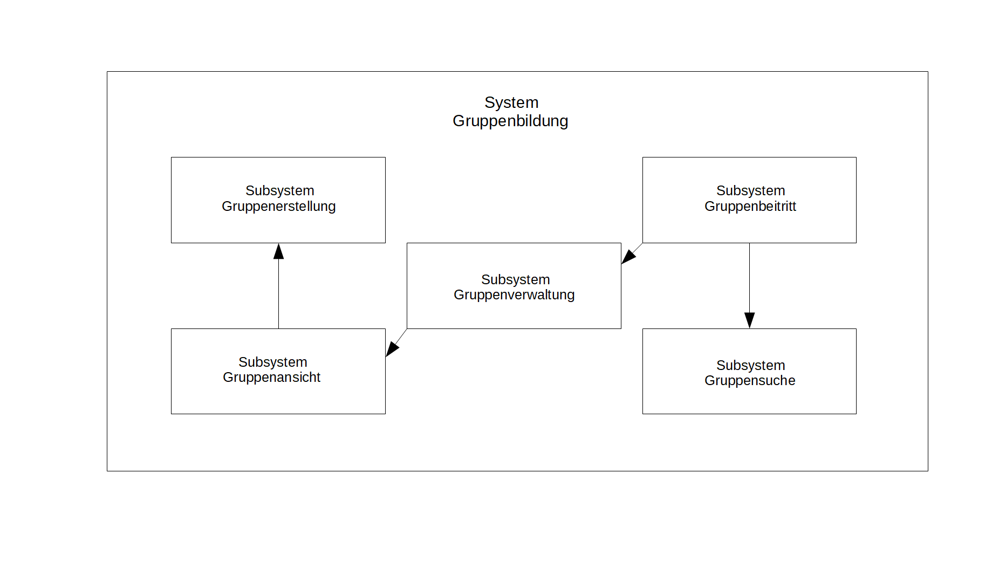

== Dokumentation der Software - Architektur des Gruppenbildungsprojekt

Dieses Dokument dient sowohl der Dokumentation, als auch der Kommunikation der
Software - Archtitektur des Gruppenbildungs - Projekts. +
Die vorliegende Dokumentation orientiert sich dabei am https://www.arc42.de[arc42 - Template] für Software -
Architektur Dokumentationen.

== Einführung und Ziele

Dieser Abschnitt führt in die Aufgabenstellung des
Gruppenbildungsprojekts ein und soll die Ziele, sowohl
die geschäftlichen als auch Qualitätsziele, darlegen.

=== Aufgabenstellung

Das primäre Ziel des Projektes ist, eine Self-Contained-System bereitzustellen, welches die
Funktion der

* Gruppenbildung
** Gruppensuche nach bestehenden Gruppen

bereitstellt. Dies soll das Organisieren von eigenen Lerngruppen/Abgabengruppen und das gemeinsame Arbeiten an
Vorlesungsinhalten und/oder Übungsblättern erleichtern.

Ein weiteres Ziel ist, dass dieses System Schnittstellen zu weiteren Systemen
bieten soll, in denen die studentischen Gruppen relevant sind. +
Diese Systeme sind:

* Materialsammlung
* Terminfindung
* Foren
* Abgabesystem

=== Qualitätsziele

Die folgende Tabelle beschreibt die Qualitätsziele des
Gruppenbildungssystems. +
Dabei spielt die Reihenfolge *keine Rolle* bezüglich der
Wichtigkeit der Ziele.

|===
|*Qualitätsziel*|*Motivation & Erläuterung*
|Leicht zugänglich & übersichtlich| User des Gruppenbildungssystems sollen
sich schnell zurecht finden. Dabei soll die UI nur notwendigste
Elemente besitzen.
|Autarkes SCS, Modularität|Die verwendete Onion - Architektur sorgt dafür,
dass externe Komponenten wie Datenbanken leicht ausgetauscht werden können,
da Abhängigkeiten zu externen Services vermieden werden.
|Gute Performance|Durch eine eventbasierte Datenbank, sowie schnellen
In - Memory Datenstrukturen wird eine gute Performance des Systems gewährleistet.
|===

=== Stakeholder

Die folgende Tabelle beschreibt Personengruppen, die einen Bezug und ein Interesse am Projekt aufweisen.

|===
|*Wer?*|*Interesse, Bezug*
|Studenten|- Wollen schnell und unkompliziert Gruppen bilden und suchen +
- erhoffen sich dadurch Zeitersparnis bei der Suche nach Kommilitonen für das gemeinsame Lernen
und für Gruppenabgaben +
- Wollen performantes System haben
|Entwickler|- Wollen System mit vertretbarem Aufwand erweitern +
- Wollen neue Systeme mit vertretbarem Aufwand an das Gruppenbildungssystem anbinden +
|Organisatoren|- Wollen selbstständig Gruppen für Ihre Veranstaltungen anlegen +
- Wollen performantes System haben
|===
****

== Kontextabgrenzung
****
Der folgende Abschnitt beschreibt die Umgebung in der sich das Gruppenbildungsprojekt befindet. +
Dabei wird darauf eingegangen, welche Nutzer das System verwenden werden und mit welchen externen
Systemen das Gruppenbildungssystem interagieren wird.

*Fachlicher Kontext*

.Kontextabgrenzung des Gruppenbildungssystems
image::kontextabgrenzung.png[]

*Studenten/Organisatoren (Benutzer)*

Den Benutzern stehen die Möglichkeiten offen Gruppen zu suchen und zu bilden.
Beim Bilden besteht hierbei die Möglichkeit Gruppenmitglieder über eine
CSV - Datei hinzuzufügen.

*Eventbasierte Datenbank*

Alle Use - Cases der Gruppenbildungsanwendung werden als Events in einer Datenbank gespeichert. +
Auf diese Weise werden alle Vorkommnisse innerhalb des Systems zur Verfügung gestellt.

*Terminfindung (Fremdsystem)*

Termine können erstellt werden und optional können die Gruppenmitglieder
einer Gruppe hinzugefügt werden.

*Abgaben (Fremdsystem)*

Eine Gruppe kann Abgaben zu einer bestimmten Veranstaltung erstellen.

*Forum (Fremdsystem)*

Eine Gruppe enthält ein Forum, das zum Austausch der Mitglieder gedacht ist.

*Materialsammlung (Fremdsystem)*

Gruppen können Materialien ablegen und verwalten.

*Technischer Kontext*
//TODO RESTFUL API, JSON

****
== Bausteinsicht
****
Der folgende Abschnitt zeigt die Zerlegung des Gruppenbildungssystems in einzelne
Module. Dabei wird die Sicht beschränkt auf die erste Zerlegungsebene, welche die
Subsysteme inklusive ihrer Schnittstellen darstellt.

*Ebene 1*

Folgende Abbildung zeigt die Zerlegung des Gruppenbildungssystems in Subsysteme.
Die Pfeile stellen fachliche Abhängigkeiten der Subsysteme untereinander
dar (“x -> y” für “x ist abhängig von y”). Die Quadrate auf der Membran des Systems sind
Interaktionspunkte mit externen Systeme.

|===
|*Subsystem*|*Kurzbeschreibung*
|Gruppenerstellung|Realisiert die Erstellung einer Gruppe
|Gruppenbeitritt|Realisiert den Gruppenbeitritt eines Users bei restringierten Gruppen.
|Gruppenansicht|Realisiert die Ansicht einer Gruppe. Dabei wird zwischen der Viewer - Sicht(einfacher User)
und der Admin - Sicht(User mit erweiterten Rechten) differenziert.
|Gruppensuche|Realisiert die Suche einer Gruppe. Dabei können sowohl öffentliche, als auch
restringierte Gruppen gesucht werden.
|===

*Blackbox - Sichten der Subsysteme*

*Gruppenerstellung*

*Zweck/Verantwortlichkeit*

Dieses Subsystem ermöglicht es eine neue Gruppe zu erstellen. +
Dabei liest das System Felder eines Formulars ein und wandelt diese dann mittels
event - basiertet Logik in ein neues Gruppen - Objekt um. +
Folgende Felder sind dabei obligatorisch:

* Gruppenname
* Veranstaltung(auch _keine Veranstaltung_ möglich)
* Gruppentyp(Public/Restricted)
* Gruppenbeschreibung
****

Mitglieder können per Suche(einzeln) oder per CSV - Datei hinzugefügt werden.

*Schnittstellen*
//TODO Schnittstellen auf Klassenebene hinzufügen

*Gruppenansicht*

*Zweck/Verantwortlichkeit*

Dieses Subsystem bietet die Übersicht einer Gruppe. +
Über diese Ansicht kann auf die Services der Fremdsysteme für die jeweilige Gruppe per
Link zugegriffen werden.(Material,Abgaben) +
Es wird eine Unterscheidung zwischen einem Viewer und einem Admin getroffen. +

|===
|*Aktion*|*Viewer Erlaubt*|*Admin Erlaubt*
|Gruppenverwaltung|Nein|Ja
|Mitglieder anzeigen|Ja|Ja
|Gruppenbeschreibung anzeigen|Ja|Ja
|Gruppe verlassen|Ja|eingeschränkt*
|===

*Ein Admin kann eine Gruppe nur verlassen, wenn ein weiterer Admin vorhanden ist. +
Ansonsten muss ein anderes Mitglied der Gruppe als Admin über die Gruppenverwaltung ausgewählt werden.

=== Abhängigkeiten der Gruppenansicht

Es besteht eine Abhängigkeit zur Gruppenerstellung, da nur vorhandene Gruppen eine
Ansicht besitzen.

*Schnittstellen*
//TODO Schnittstellen auf Klassenebene hinzufügen

=== Gruppenverwaltung

*Zweck/Verantwortlichkeit*

Dieses Subsystem ermöglicht es dem Admin einer Gruppe gruppenspezifische Dinge
zu verwalten: +

* Gesamte Gruppe löschen
* Gruppenbeschreibung/Gruppenname ändern
* Offene Gruppenanfragen beantworten
* Gruppenmitgliedschaften verwalten

==== Abhängigkeiten der Gruppenverwaltung

Es besteht eine Abhängigkeit zur Gruppenansicht, da man nur über die Gruppenansicht
zu Gruppenverwaltungs - Aufgaben gelangt.

*Schnittstellen*
//TODO Schnittstellen auf Klassenebene hinzufügen

=== Gruppensuche

*Zweck/Verantwortlichkeit*

Dieses Subsystem ermöglicht es nach bestehenden Gruppen zu suchen. +

//TODO Matching erklären

*Schnittstellen*
//TODO Schnittstellen auf Klassenebene hinzufügen

=== Gruppenbeitritt

*Zweck/Verantwortlichkeit*

Dieses Subsystem ermöglicht es einer öffentlichen Gruppe beizutreten oder
an eine restringierte Gruppe einen Aufnahmeantrag zu stellen. +

==== Abhängigkeiten

Es besteht eine Abhängigkeit zur Gruppensuche, da man nur Gruppen beitreten kann, die
zuvor über die Suche gefunden wurden. +
Es besteht eine Abhängigkeit zur Gruppenverwaltung, da restringierten Gruppen nicht
ohne Zustimmung eines Admins beigetreten werden kann.

*Schnittstellen*
//TODO Schnittstellen auf Klassenebene hinzufügen

== Entscheidungen

=== Generierung der EventID

Die EventID soll in der Datenbank erzeugt werden (ist also keine UUID), da die ID in der Datenbank die Reihenfolge der
Erstellung mit abbildet.

Attribute des GroupService

Wir haben uns entschieden, für groups und users HashMaps (statt HashSets) zu verwenden, da so ein einfacherer Zugriff
(über die jeweilige ID bzw. den Namen) auf die entsprechenden Objekte erfolgen kann.

=== Testing

Das Testen der Eventklassen soll in einzelnen entsprechenden Testklassen erfolgen (und nicht in einer einzigen
Testklasse). Es gibt eine Hilfsklasse (TestSetup), in der ein SetUp an Datenstrukturen erstellt wird, auf die sich
die einzelnen Event-Tests dann beziehen können.

Gruppenlöschungen vs. Gruppe verlassen - User Management

Wir haben uns entschieden, dass wir bei Gruppenlöschungen auch direkt die Memberships mit löschen und die Gruppe selbst
als deaktiviert hinterlegen. Sofern ein User lediglich eine Gruppe verlässt oder von einem Administrator aus der Gruppe
entfernt wird haben wir uns dahingegen dazu entschieden diesen nicht vollständig aus der Gruppe zu löschen, sondern
seinen Status lediglich auf deaktiviert setzen. Dies hat den Hintergrund, dass man so z.B. im Nachhinein anhand des
Status verschiedene Optionen für einen deaktivierten User offen lässt, beispielsweise, dass er optional nicht mehr der
Gruppe beitreten darf, wenn er die Gruppe einmal verlassen hat. Solche Änderungen wären bei einer direkten Löschung
nicht mehr möglich.

=== Implementierung der Suche

Wir haben uns aktuell dazu entschieden die Suche nach neuen Gruppen auf jeder von uns implementierten Seite zu
ermöglichen, da uns nicht empfohlen wurde das Suchicon per css-File zu überschreiben, und wir, sofern dieses bestehen
bleibt, auch eine Implementierung für sinnvoll erachten. Sollte es im Nachhinein eine Änderungen diesbezüglich geben,
so kann die Implementierung der Suche leicht gelöscht werden, da diese im Controller in eine Methode ausgelagert wurde.

=== Input - Transfer

Die Weitergabe der vom Controller bereitgestellten Parameter soll über ApplicationService und GroupService bis hin zu
den einzelnen Events als Strings/Primitives erfolgen. Dies hat den Hintergrund, dass alle Eventklassen nur Strings als
Attribute besitzen, um das JSON-Mapping (Jackson) von Objekt -→ JSON-String und umgekehrt zu erleichtern. Jackson stellt
keine simple Methode bereit, die verschiedene Objekt-Attribute in einen geschachtelten JSON-String umwandeln kann.
Alle Attribute sollten sich also im JSON-String auf der gleichen Ebene befinden, da dort unterschiedliche Objekte
nicht mehr mit abgebildet werden können.